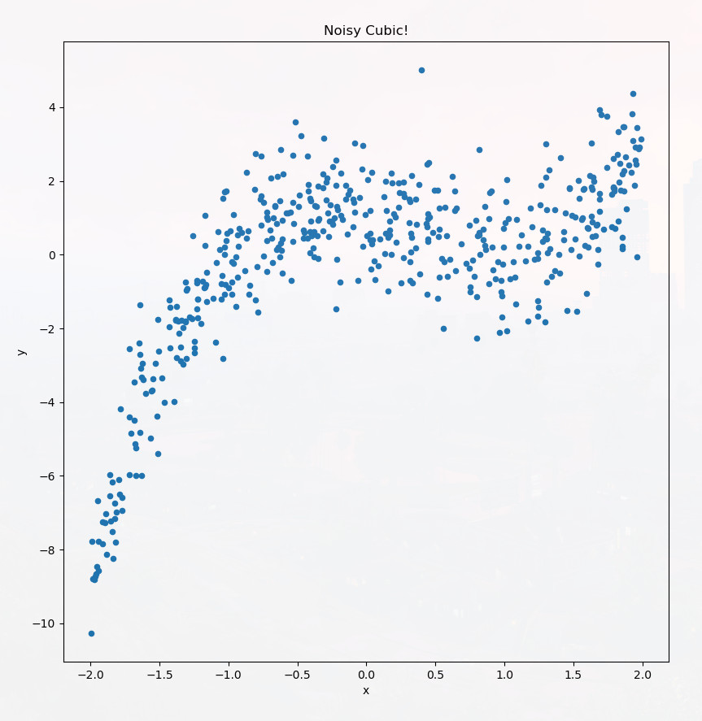
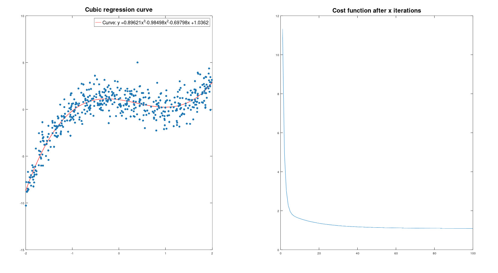

# Cubic Regression with Gradient Descent

Suppose we have a data set which appears definitely non-linear. Can we approximate it by a quadratic, or cubic, or other higher degree polynomial in a reasonable way? It might seem like this problem is strictly harder than linear regression, but in fact can be solved by just the (multivariate) linear case! As a demonstration, this repository shows how cubic regression can be done using the linear case.

Here is a data set that looks like it might be well-modeled by a cubic polynomial.

Can we find a "cubic of best fit" for the dataset? The main idea is we can think of a general cubic as being parametrized by four coefficients: y = theta_3 x^3 + theta_2 x^2 + theta_1 x + theta_0. Given our list of features X, we can create new features: the squares and cubes of the list in X. Then we perform linear regression to optimize the theta_i's for the usual MSE cost function.

This process is carried out in the Octave/MATLAB code above. To run through the process with a new randomly generated data set, follow these steps:
1. Go to the `Data` directory and run `python cubic_datagen.py` to create a new .csv file for the dataset here.
2. Run `python graph_cubic_data.py` to see a visual for the dataset, like the one above, produced using Matplotlib.
3. Go to the `Learning` directory and run `cubicLearn` from Octave/MATLAB to create the cubic of best fit. This will also produce a visualization of the cubic and the cost function as a function of the number of iterations of gradient descent. 

